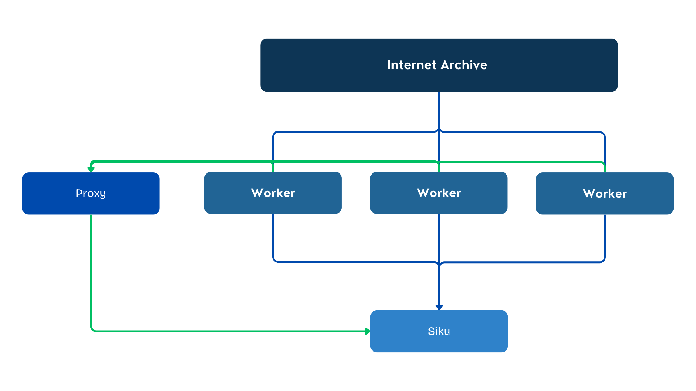
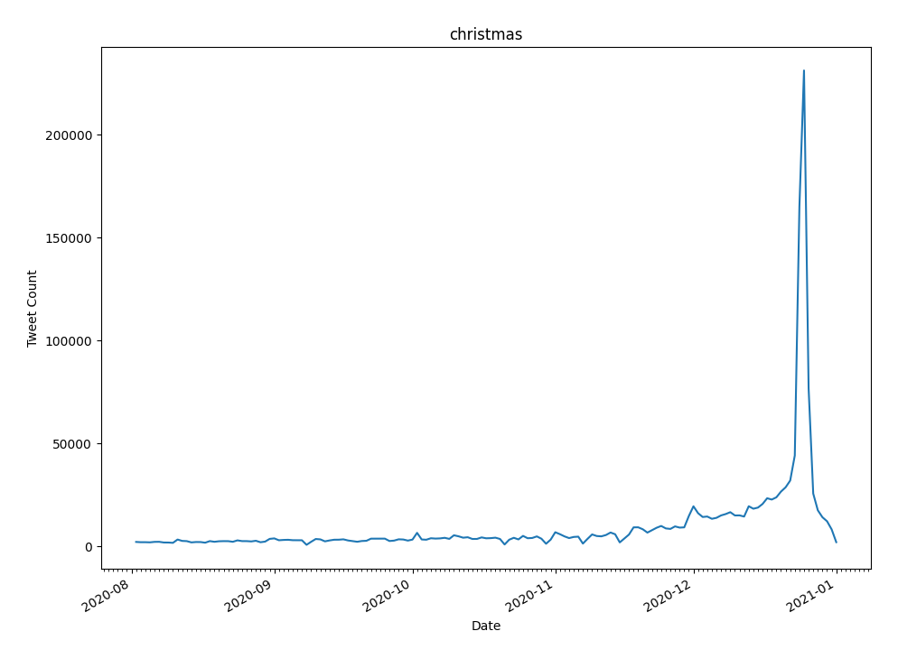
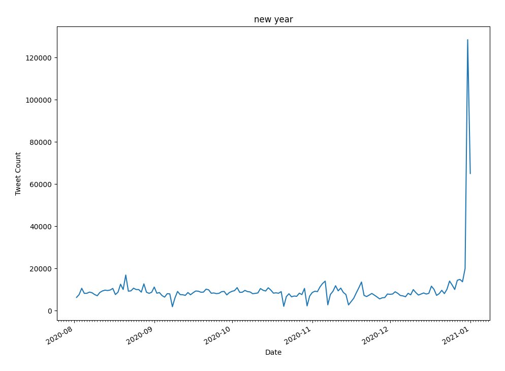
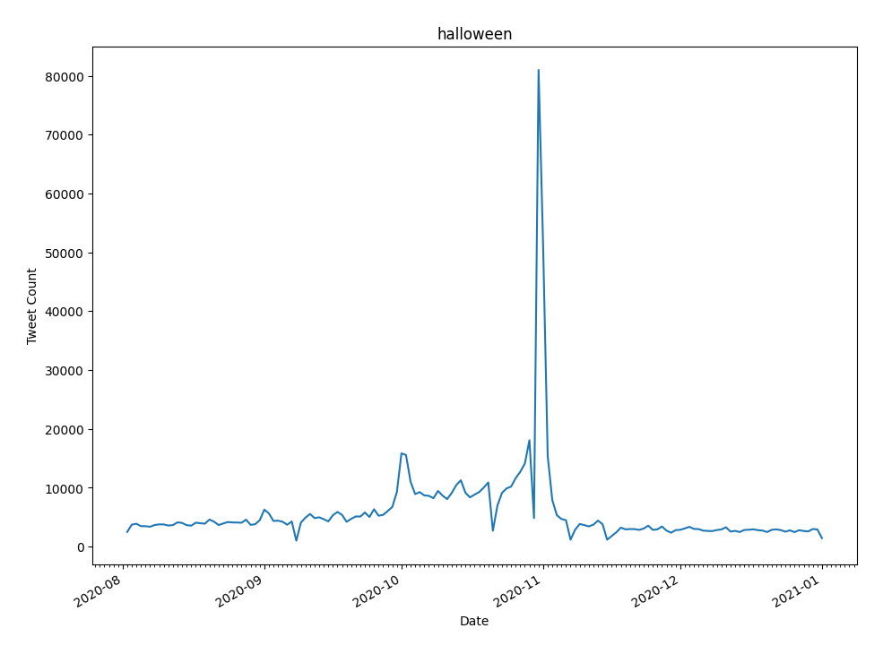
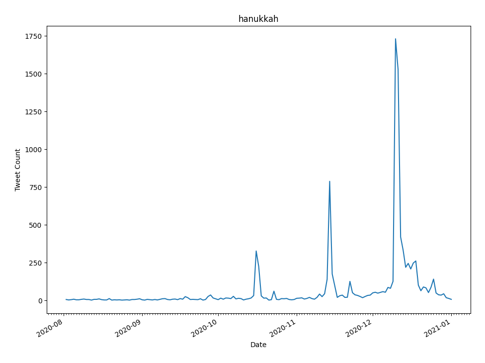
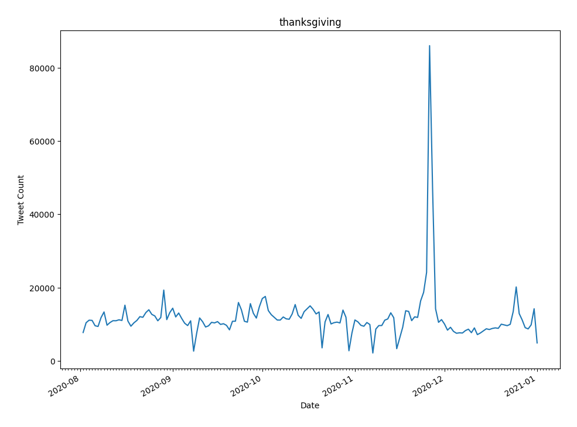
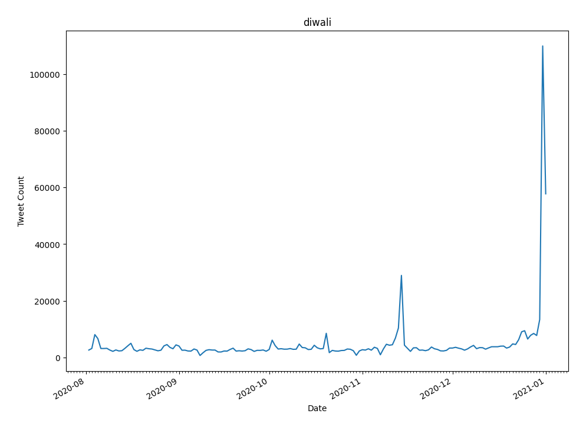

# Twitter Internet Archive Holidays Analysis
This project downloads data from [Internet Archive](https://archive.org/details/twitterstream). Multiple "worker" servers download these files since the Internet Archive sets a low download speed. Then a Proxy server acts like a man in the middle between the Worker servers and the supercomputer Siku. The proxy manages when worker servers should upload their file to the supercomputer and when the supercomputer has finished submitting a job. This project used collections from August 2020 to December 2020 and created a timeline of how often certain holidays were mentioned. \


# Script Explanations
## Worker 
This portion downloads the files to then be processed by the super computer. This can be ran on multiple cloud instances to get around the download limit imposed by the Internet Archive. To run this:
```
$ sudo apt install python3-venv 
$ python3 -m venv .venv 
$ source .venv/bin/activate 
$ pip install progressbar requests
$ sudo apt install sshpass
$ git clone https://github.com/Sietseq/Twitter-Internet-Archive-Holidays-Analysis.git
$ cd Twitter-Internet-Archive-Holidays-Analysis/Worker
$ mkdir download
$ touch files.txt  
```
You will also have to go into ```worker.py``` and edit the proxy ip used and the username used for Siku.. Be sure to login at least to generate a fingerprint for the scp process.\
After file the files.txt file with the links to which files you want to download with this instance.\
Then to run:
```
nohup python worker.py &
```

## Proxy
The proxy is a flask server that keeps a queue of which files are ready to upload to the server and when the supercomputer can submit the job. To run this server:
```
$ sudo apt install python3-venv 
$ python3 -m venv .venv 
$ source .venv/bin/activate
$ pip install flask
$ git clone https://github.com/Sietseq/Twitter-Internet-Archive-Holidays-Analysis.git
$ cd Twitter-Internet-Archive-Holidays-Analysis/Proxy
$ sudo apt install nginx
$ nano /etc/nginx/sites-enabled
```
In this edit file as such:
```
server {
    listen 80;
    listen [::]:80;
    server_name <YOUR INSTANCE IP>;
        
    location / {
        proxy_pass http://127.0.0.1:5000;
        include proxy_params;
    }
}
```
Replacing ```<YOUR INSTANCE IP>``` with the server's public IPv4 address.\
Then you can run
```
nohup python server.py &
```

## Siku
Siku was used to do the actual analysis of the data. Whenever the proxy server notifies that the file has been fully uploaded, it will extract the file and submit a job to extract all data from this file. 
```
$ sudo apt install python3-venv 
$ python3 -m venv .venv 
$ source .venv/bin/activate
$ pip install patoolib requests
$ git clone https://github.com/Sietseq/Twitter-Internet-Archive-Holidays-Analysis.git
$ cd Twitter-Internet-Archive-Holidays-Analysis/Siku
$ mkdir counts
$ mkdir out
$ mkdir upload
$ nohup python job.py &
```
This will make it so that all outputs are sent to the out directory and any finished counts are sent to the counts directory. You will also need to update the ip in ```job.py```. 

## Tools
### Combine.py
Once you have retrieved your counts folder use this script to combine all counts into one count.
### Graph.py
Pass the count from combine.py into this script to generate graphs. 

# Results
After fully downloading and computing all available from August 2020 to December 2020 the following usefull graphs were generated. 







Other holidays were also included but gave false peaks if the holiday was not in the range that was analyzed.\
The graphs for Christmas, New Year, and Halloween are self explanatory but it is worth looking at the rest more in depth.\
The Hanukkah graph fully shows Hanukkah itself but also has three other peaks that could potentially reasons for peaks in words related to Hanukkah.\
The Thanksgiving graph also shows Christmas. This is most likely because the dinner portion of Christmas and Thanksgiving are very similiar.\
The Diwali graph has a small peak for Diwali but a huge peak for New Years. This is most likely because the celebrations are very similiar. \
<br>
This shows that we should be careful to not be too broad in our keywords that we choose for each category. 
